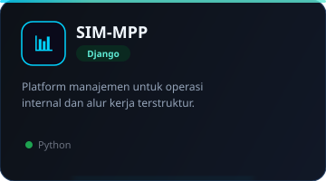
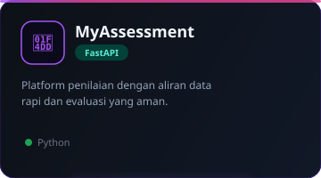
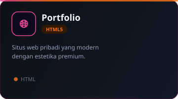
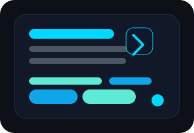

<div align="center">
  
</div>

<div align="center">
  
</div>

<br/>

<div align="center">
  <a href="https://github.com/Ws529"></a>
  <a href="https://www.linkedin.com/"></a>
  
</div>

<br/>


## 🧑‍💻 About Me

```python
class WawanSuwandi:
    def __init__(self):
        self.name = "Wawan Suwandi"
        self.role = "Backend Developer"
        self.campus = "TI.23.A.5"
        self.languages = ["Python", "JavaScript", "SQL"]
        self.interests = ["REST APIs", "Clean Architecture", "DevOps"]
        
    def say_hi(self):
        print("Thanks for visiting my profile! Let's build something great.")

me = WawanSuwandi()
me.say_hi()
```

> *"Siapa pun bisa menulis kode yang dipahami komputer. Programmer yang baik menulis kode yang dipahami manusia."*
> — Martin Fowler


## ⚡ Tech Stack

<div align="center">

### 🔧 Backend & Languages


### 🗄️ Database


### 🎨 Frontend


### 🛠️ DevOps & Tools


</div>


## 📊 GitHub Stats

<div align="center">
  
  
</div>

<br/>

<div align="center">
  
</div>

<br/>

<div align="center">
  
</div>

<br/>

<div align="center">
  
</div>


## 🐍 Contribution Snake

<div align="center">
  <picture>
    <source media="(prefers-color-scheme: dark)" srcset="https://raw.githubusercontent.com/Ws529/Ws529/output/github-contribution-grid-snake-dark.svg" />
    <source media="(prefers-color-scheme: light)" srcset="https://raw.githubusercontent.com/Ws529/Ws529/output/github-contribution-grid-snake.svg" />
    
  </picture>
</div>


## 🏗️ Featured Projects

<div align="center">
  <table>
    <tr>
      <td width="33%" align="center">
        
        <br/><br/>
        <a href="https://github.com/Ws529/Sistem-Manajemen-Magang"></a>
      </td>
      <td width="33%" align="center">
        
        <br/><br/>
        <a href="https://github.com/Ws529/MyAssessment_Final"></a>
      </td>
      <td width="33%" align="center">
        
        <br/><br/>
        <a href="https://github.com/Ws529/portfolio"></a>
      </td>
    </tr>
  </table>
</div>


## 💻 Coding Vibes

<div align="center">
  
</div>

<div align="center">
  <br/>
  
</div>


## 📫 Let's Connect

<div align="center">
  <a href="https://github.com/Ws529"></a>
  <a href="https://www.linkedin.com/"></a>
  <a href="mailto:your@email.com"></a>
</div>

<br/>

<div align="center">
  
</div>


